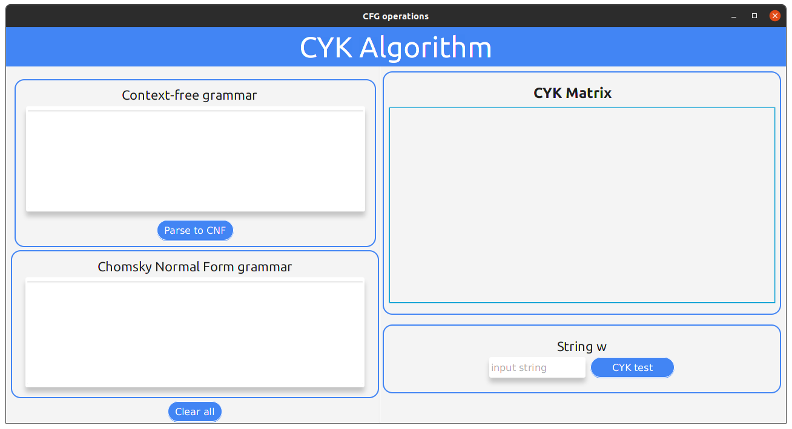
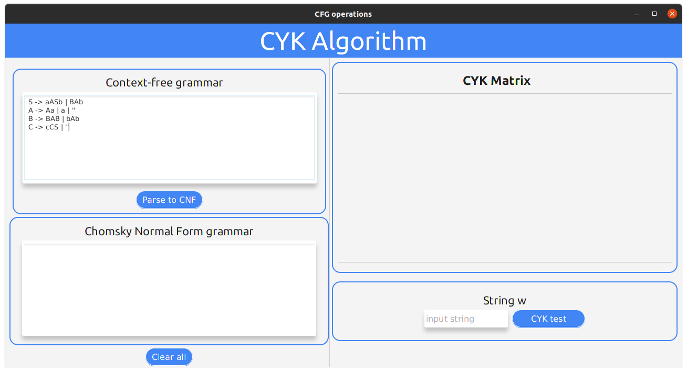
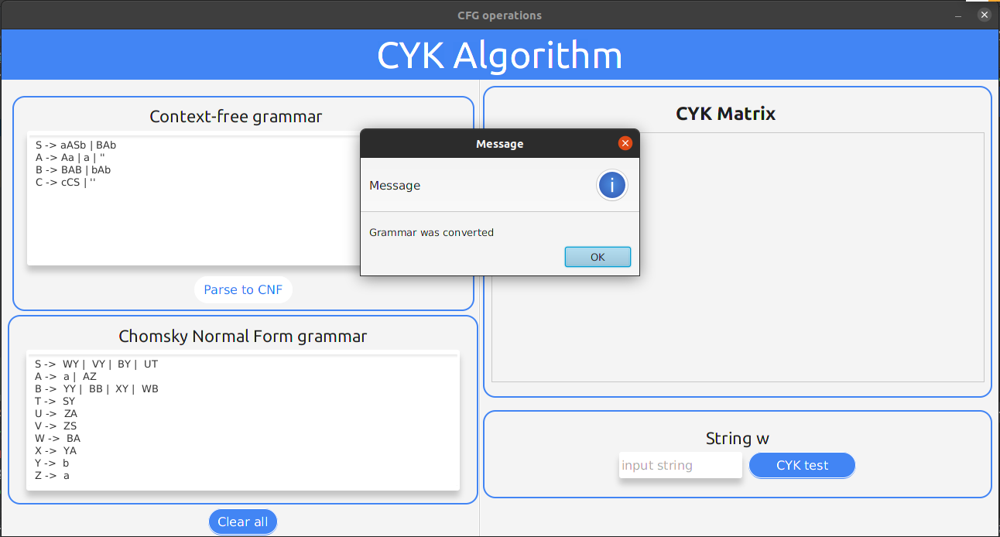
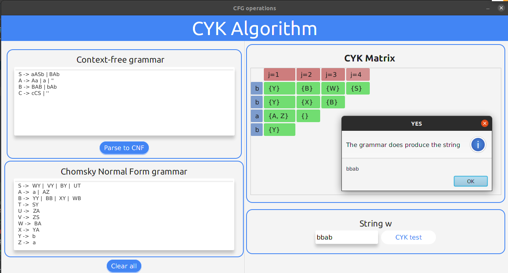
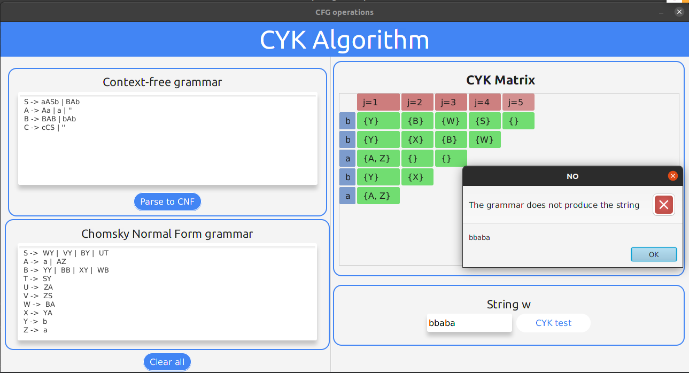

# CYK tester
This program allows you to validate whether a Context-free grammar produces a given string w using CYK algorithm; w ∈ L (G)?.  
It allows you to enter any grammar, not only grammars that are already in Chomsky Normal Form.

These are the steps that you can follow to use the functionality:

#### 1 Import the project to your favorite IDE
This is an IntelliJ IDEA project, but you can open it and configure it in your favorite IDE.

#### 2 Run the program
Run the program as you usually do in your IDE. If you do not have an IDE installed, you can run it from terminal.
In the project folder run the following commands.
~~~bash
cd out/production/theoretical-computing-CYK$
java ui.Main
~~~

#### 3 (Optional) Input a CFG and convert it to CNF
If you want to use CYK, and the grammar is not already in CNF, paste it in the `Context-free grammar` text area.  
Press `Parse to CNF` and the equivalent grammar in CNF will appear in `Chomsky Normal Form grammar` text area.

#### 4 Test the grammar in CNF with a string w
In the `Chomsky Normal Form grammar` text area input a grammar in CNF (If you did the previous step, the grammar is already in this form).  
In the `String w` section, input the desired string.  
Press `CYK test` button, and it will perform CYK algorithm with the given grammar and string.  
A popup window will tell you if the grammar produces the string or not.  
In the `CYK Matrix` section you can see the matrix Xij used in CYK.  

If the grammar does not generate the string, the popup window shows that information.

